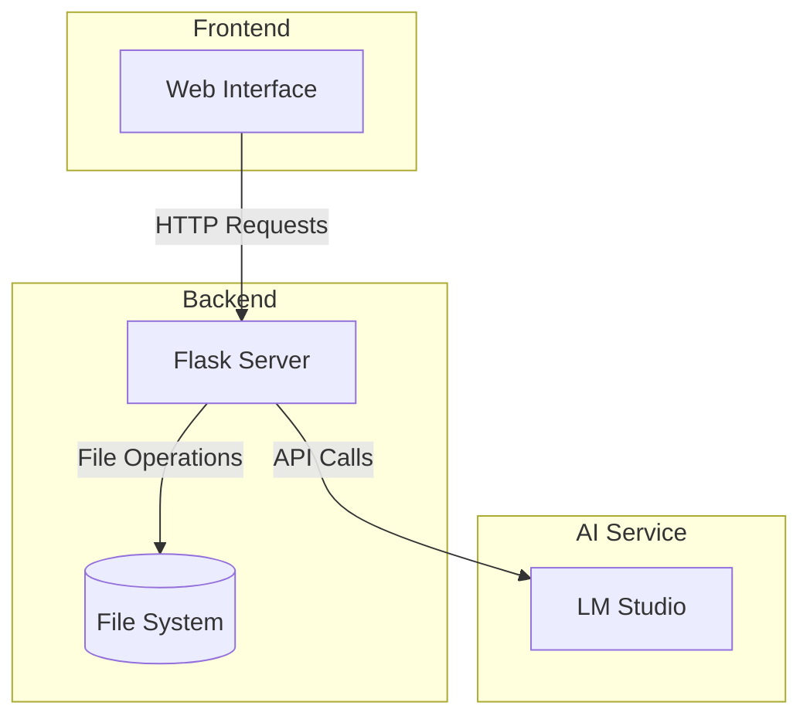

# **Technical Guide: LM Studio Chat Interface**

This comprehensive guide explains the architecture, implementation details, and customization options for the LM Studio Chat Interface.

## **📋 Table of Contents**

1. [Architecture Overview](#architecture)
2. [Component Breakdown](#components)
3. [Data Flow](#data-flow)
4. [Implementation Details](#implementation)
5. [Customization Guide](#customization)
6. [Security Considerations](#security)
7. [Performance Optimization](#performance)
8. [Troubleshooting Guide](#troubleshooting)

## **🏗️ Architecture Overview** {#architecture}

The application follows a client-server architecture with these main components:



### **Key Components:**
- **Web Interface**: HTML/CSS/JavaScript frontend
- **Flask Server**: Python backend handling requests
- **File System**: Local storage for uploaded documents
- **LM Studio Integration**: API connection to LM Studio

## **🔍 Component Breakdown** {#components}

### **1. Frontend Components**

- **Upload Section**: Handles file uploads
- **File List**: Displays available documents
- **Configuration Panel**: LM Studio connection settings
- **Chat Interface**: Message input and display
- **Copy Functionality**: One-click file referencing

### **2. Backend Services**

- **File Management**: Upload and retrieval
- **Chat Processing**: Message handling and LM Studio communication
- **Model Integration**: Automatic model detection and selection
- **Error Handling**: Comprehensive error management

## **📊 Data Flow** {#data-flow}

1. **File Upload Process:**
   ```mermaid
   sequenceDiagram
       participant User
       participant Frontend
       participant Flask
       participant FileSystem
       
       User->>Frontend: Select File
       Frontend->>Flask: POST /upload
       Flask->>FileSystem: Save File
       Flask->>Frontend: Refresh File List
       Frontend->>User: Show Success
   ```

2. **Chat Process:**
   ```mermaid
   sequenceDiagram
       participant User
       participant Frontend
       participant Flask
       participant FileSystem
       participant LMStudio
       
       User->>Frontend: Send Message
       Frontend->>Flask: POST /chat
       Flask->>FileSystem: Read Referenced Files
       Flask->>LMStudio: Request Completion
       LMStudio->>Flask: Return Response
       Flask->>Frontend: Send Response
       Frontend->>User: Display Response
   ```

## **💻 Implementation Details** {#implementation}

### **1. File Referencing System**

The @mention system works through:
```python
def extract_document_name(message):
    # Look for @filename.txt pattern
    matches = re.findall(r'@([\w.-]+\.txt)', message)
    if matches:
        return matches[0]
    return None
```

### **2. Message Processing**

Messages are processed in stages:
1. Extract file references
2. Load file contents
3. Construct prompt
4. Send to LM Studio
5. Process response

### **3. Error Handling**

Comprehensive error handling for:
- File not found
- LM Studio connection issues
- Invalid file formats
- Malformed requests

## **🎨 Customization Guide** {#customization}

### **1. Styling**

The interface can be customized through:
- `style.css` for visual elements
- Color schemes and layouts
- Responsive design breakpoints

### **2. Functionality**

Extend functionality by:
- Adding new file types
- Implementing additional API endpoints
- Creating custom message processors

### **3. Integration**

Adapt for different environments:
- Custom LM Studio configurations
- Alternative AI models
- Different storage solutions

## **🔒 Security Considerations** {#security}

1. **File Upload Security**
   - File type validation
   - Size limitations
   - Path traversal prevention

2. **API Security**
   - Input sanitization
   - Rate limiting
   - Error message safety

## **⚡ Performance Optimization** {#performance}

1. **Frontend Optimization**
   - Efficient DOM updates
   - Debounced inputs
   - Cached file list

2. **Backend Optimization**
   - Async file operations
   - Response streaming
   - Connection pooling

## **🔧 Troubleshooting Guide** {#troubleshooting}

### **Common Issues and Solutions**

1. **Connection Issues**
   ```
   Error: Connection refused
   Solution: Check LM Studio status and port configuration
   ```

2. **File Processing Issues**
   ```
   Error: File not found
   Solution: Verify file path and permissions
   ```

3. **Response Issues**
   ```
   Error: Empty response
   Solution: Check model loading in LM Studio
   ```

## **📈 Future Improvements**

Potential enhancements:
1. Multiple file support in single query
2. File content caching
3. User sessions and history
4. Advanced file management
5. Custom model parameters

## **🔍 Debugging Tips**

Enable debug mode for detailed logs:
```python
app.run(debug=True)
```

Monitor the Flask console for:
- Request details
- File operations
- LM Studio communication
- Error traces

---

This guide serves as a comprehensive reference for understanding, implementing, and customizing the LM Studio Chat Interface. For specific questions or issues, refer to the relevant sections or create an issue in the repository.